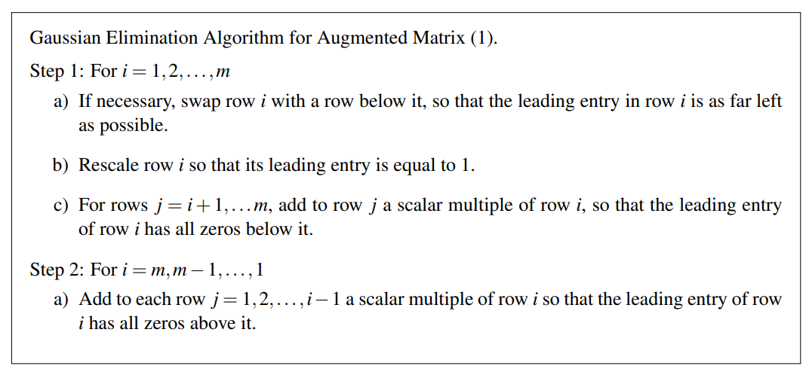
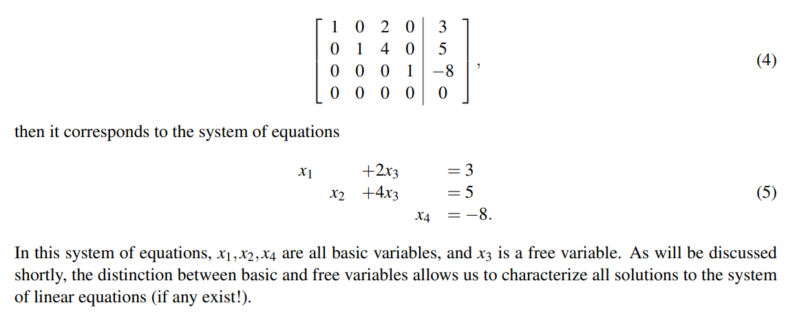

# gaussian elimination
1.First, we selected an equation involving x (possibly with some coefficient) and scaled it to make the x
coefficient unity.
2.Then, we added multiples of this equation from all the other equations to eliminate x, producing a
system with one fewer unknown and one fewer equation.
3.We then repeated the first two steps until we arrived at an equation with exactly one unknown, which
we could solve directly
4.Finally, we substituted the known value of the final unknown into a previous equation to recover the
last two unknowns, and continued substituting until we recovered all of our unknowns!

# gaussian elimination algorithm in augmented matrix

Observe that at the conclusion of Step 1, we are left with a matrix satisfying the following three properties:
• All nonzero rows are above all zero rows.
• The leading entries of a non-zero row is always to the right of the leading entries of the row above it.
• All leading entries of non-zero rows are equal to 1.

Step 2 corresponds to the “back-substitution" of variables performed in the previous examples. At the
conclusion of Step 2, we are left with a matrix satisfying the following two properties:
• The matrix is in row echelon form.
• Each leading entry of a nonzero row is the only nonzero entry in its column.
# reduced row echelon form
Once an augmented matrix is reduced to reduced row echelon form, variables corresponding to
columns containing leading entries are called basic variables, and the remaining variables are called free variables

